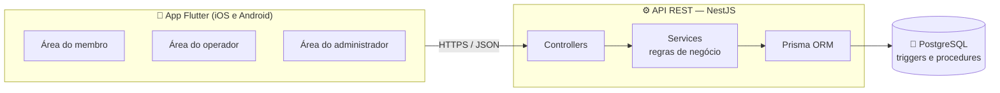

<div align="center">

# 🪪 MembroPass

**Carteirinha digital white-label para programas de associados**


Trabalho final de **HADS022 – Laboratório de Desenvolvimento de Sistemas**<br>
Análise e Desenvolvimento de Sistemas · Universidade de Passo Fundo · 2026/2

</div>

---

## 📋 Sumário

- [Sobre o projeto](#-sobre-o-projeto)
- [Funcionalidades do MVP](#-funcionalidades-do-mvp)
- [Arquitetura](#-arquitetura)
- [Tecnologias](#-tecnologias)
- [Estrutura do repositório](#-estrutura-do-repositório)
- [Como executar](#-como-executar)
- [Documentação](#-documentação)
- [Cronograma](#-cronograma)
- [Autora](#-autora)

## 💡 Sobre o projeto

Clubes, academias, associações e sindicatos costumam controlar seus associados com carteirinhas de papel
e planilhas. O **MembroPass** substitui esse processo por uma plataforma em que:

- a **organização** configura planos, benefícios, unidades e a própria marca da carteirinha;
- o **membro** apresenta uma carteirinha digital com QR Code no celular;
- o **operador** valida o acesso nas unidades e eventos lendo o QR Code.

O pagamento da mensalidade é combinado fora do aplicativo. O administrador confirma o recebimento
para liberar um novo ciclo e decide manualmente quando bloquear um membro vencido. O sistema nunca
bloqueia nem libera de forma automática.

## ✅ Funcionalidades do MVP

| Perfil | Funcionalidades |
|---|---|
| 🏢 **Administrador da organização** | Cadastro da organização · planos de associação · benefícios · membros · unidades e eventos · liberação de ciclo e bloqueio manual · identidade visual da carteirinha · auditoria |
| 🙋 **Membro** | Carteirinha digital com QR Code · status do ciclo · benefícios do plano |
| 🎫 **Operador** | Leitura do QR Code e registro do check-in |

Escopo completo e itens fora do MVP: [`docs/MVP.md`](docs/MVP.md).

## 🏗️ Arquitetura

Arquitetura em camadas, com isolamento de dados por organização (multi-tenant).



## 🛠️ Tecnologias

| Camada | Tecnologia |
|---|---|
| Aplicativo | Flutter · Dart · mobile_scanner · qr_flutter |
| API | Node.js 22 · NestJS · class-validator |
| Banco de dados | PostgreSQL 17 · Prisma ORM |
| Testes | Vitest (API) · flutter_test (app) |
| Infraestrutura | Docker Compose |
| Modelagem | Draw.io · dbdiagram.io |

## 📁 Estrutura do repositório

```
MembroPass/
├── api/                 # API REST (NestJS + Prisma)
├── app/                 # Aplicativo Flutter
├── database/            # Scripts SQL: criação, dados de teste, triggers e procedures
├── docs/
│   ├── dvp/             # Documento de Visão do Produto
│   ├── diagramas/       # Casos de uso, classes, componentes e modelo lógico
│   ├── MVP.md           # Definição do MVP
│   ├── CRONOGRAMA.md    # Cronograma de implementação
│   └── STATUS.md        # Status semanal
└── docker-compose.yml   # Banco de dados local
```

## 🚀 Como executar

**Pré-requisitos:** [Node.js 22+](https://nodejs.org), [Flutter 3.35+](https://docs.flutter.dev/get-started/install)
e [Docker](https://www.docker.com/products/docker-desktop).

```bash
# 1. Subir o banco de dados
docker compose up -d

# 2. API (http://localhost:3000)
cd api
cp .env.example .env
npm install
npx prisma migrate deploy   # cria as tabelas, triggers e procedures
npm run db:seed             # dados de teste (senha: Senha@123)
npm run start:dev

# 3. Aplicativo
cd app
flutter pub get
flutter run
```

Detalhes de cada parte: [`api/README.md`](api/README.md) · [`app/README.md`](app/README.md).

## 📚 Documentação

| Documento | Descrição |
|---|---|
| [DVP v2.6](docs/dvp/MembroPass_DVP_v2_6.pdf) | Documento de Visão do Produto: requisitos, casos de uso, arquitetura e modelo de dados |
| [MVP](docs/MVP.md) | Escopo implementado nesta versão |
| [Cronograma](docs/CRONOGRAMA.md) | Entregas semanais |
| [Status](docs/STATUS.md) | Andamento atualizado a cada semana |
| [Banco de dados](database/README.md) | Scripts SQL |
| [Convenções](docs/CONVENCOES.md) | Padrão de commits e de versionamento |

## 📅 Cronograma

| Semana | Entrega | Conteúdo | Status |
|:---:|:---:|---|:---:|
| 1 | 05/10 | MVP e estrutura do repositório | ✅ |
| 2 | 12/10 | Banco de dados e esqueleto da API | ✅ |
| 3 | 19/10 | Login e perfis | ⏳ |
| 4 | 26/10 | Organização, planos e benefícios | ⬜ |
| 5 | 02/11 | Membros e carteirinha digital | ⬜ |
| 6 | 09/11 | Liberação de ciclo, bloqueio e auditoria | ⬜ |
| 7 | 16/11 | Unidades, eventos e check-in | ⬜ |
| 8 | 23/11 | White-label, suporte e testes | ⬜ |

✅ concluído · ⏳ em andamento · ⬜ a fazer

## 👩‍💻 Autora

**Julia Camini Veiga**<br>
Orientação: Prof. Jaqson Dalbosco e Prof. Jeangrei Emanoelli Veiga
